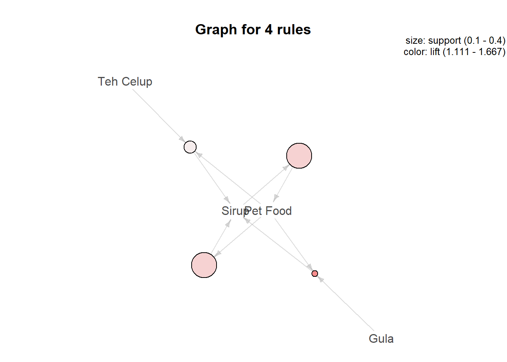

# Market Basket Analysis Using Apriori Algorithm

One of the business innovations in the retail sector is looking for associations or relationships between products from sales transaction data that aim to:

* packaged and sold together.
* provide a product recommendation to someone.
* arrange display racks.
* compile e-commerce product pages.

All of these things aim to increase sales as well as solve inventory problems - because products that don’t sell well if paired correctly are more attractive and are more likely to be purchased in one package. This process is an analysis process known as Market Basket Analysis (MBA).

The algorithm that can be used in R to do this MBA is apriori from package arules. Only two data are needed, namely transaction data and product data.

